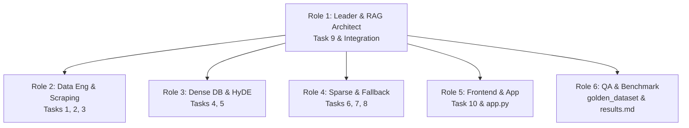

# Comprehensive Plan: Day 8 RAG Pipeline - University Services RAG Chatbot (RMIT Vietnam)

## 📌 Project Overview & Technical Architecture
Build a production-ready, enterprise-grade University Services RAG (Retrieval-Augmented Generation) chatbot for Day 8 Lab with:
- **Corpus Standardization & Metadata Tagging**: Raw University Services policy PDFs (`data/landing/legal/`) and News/Announcements (`data/landing/news/`) converted to standardized Markdown (`data/standardized/`) enriched with `customer_role` metadata (`student`, `applicant`, `staff`, `both`).
- **Domain**: **RMIT Vietnam** (rmit.edu.vn) — Tuition fees, scholarships, accommodation/dormitory, course registration, library services, student support.
- **Hybrid Retrieval System**: Dense Semantic Search (ChromaDB + HyDE) + Lexical Keyword Search (BM25 for course codes, scholarship names, policy IDs) fused via Reciprocal Rank Fusion ($RRF(d) = \sum \frac{1}{60 + r(d)}$).
- **Structure-Aware Fallback**: Automated fallback to PageIndex vectorless RAG when original Cosine similarity score falls below `0.48` (`dense_results[0]['score'] < 0.48`).
- **Lost-in-the-Middle Mitigation & Citation**: Interleaved candidate chunk reordering (`front + back[::-1]`) and LLM generation with strict `[Source N]` citations.
- **Testing & Benchmarking**: 10 individual tasks verified via `pytest tests/test_individual.py -v` (35/35 PASSED target), interactive Streamlit Chatbot (`app.py`), 20-question `golden_dataset.json`, and RAGAS benchmark report (`results.md`).

---

## 🔑 Environment & Key Configuration (`.env`)

| Variable | Configured Value / Usage | Status |
|----------|--------------------------|--------|
| `AI_STUDIO_API_KEY` | Gemini API Key | Active |
| `AI_MODEL` | `gemma-4-26b-a4b-it` | Active |
| `EMBEDDING_MODEL` | `gemini-embedding-2` / `BAAI/bge-m3` | Active |
| `PAGEINDEX_API_KEY` | `0f3dc4ec02b24f20becd09fa0c202e6d` (Task 8 Fallback) | Active |
| `OPENROUTER_API_KEY` | OpenRouter API Key | Active |
| `OPENROUTER_RERANKER_MODEL` | `nvidia/llama-nemotron-rerank-vl-1b-v2:free` | Active |
| `OPENROUTER_EMBEDDING_MODEL` | `nvidia/nemotron-3-embed-1b:free` | Active |
| `JINA_API_KEY` | Commented out | **Fallback Only** (Secondary optional reranker) |

---

## 🛠️ Detailed 10-Task Execution Plan

### 🔹 Task 1 & 2: Initial Data Collection (RMIT University Policies & News)
- **Task 1 (`src/task1_collect_legal_docs.py`)**: Store $\ge 3$ RMIT Vietnam policy PDF/DOCX files (Tuition & Payment Policy, Scholarship Guidelines, Accommodation & Dormitory Regulations) in `data/landing/legal/`.
- **Task 2 (`src/task2_crawl_news.py`)**: Store $\ge 5$ RMIT Vietnam news/announcement JSON files in `data/landing/news/` with metadata (`url`, `title`, `date_crawled`, `customer_role`, `content_markdown`).

### 🔹 Task 3: Markdown Standardization
- **Script (`src/task3_convert_markdown.py`)**: Convert all PDF/DOCX/JSON files into clean Markdown (`.md`) files in `data/standardized/legal/` and `data/standardized/news/`.
- **Frontmatter Metadata**:
  ```markdown
  ---
  title: "Quy Định Học Phí & Phương Thức Thanh Toán RMIT"
  source_type: "legal"
  customer_role: "student"
  url: "https://www.rmit.edu.vn/study-at-rmit/tuition-fees"
  ---
  ```

### 🔹 Task 4: Chunking & Indexing with `customer_role`
- **Script (`src/task4_chunking_indexing.py`)**:
  - Split text into chunks (`CHUNK_SIZE=800`, `CHUNK_OVERLAP=100`).
  - Attach `customer_role` metadata (`student`, `applicant`, `staff`, `both`).
  - Embed chunks using 1024-dim model (`BAAI/bge-m3` or `gemini-embedding-2`) and persist into `chroma_db/`.

### 🔹 Task 5 & 6: Semantic Search (Dense + HyDE) & BM25 Lexical Search
- **Task 5 (`src/task5_semantic_search.py`)**: Dense Cosine Similarity search over ChromaDB + HyDE hypothetical document expansion.
- **Task 6 (`src/task6_lexical_search.py`)**: BM25 Sparse Lexical search (`rank_bm25`) for exact keyword matching (course codes `COSC2430`, scholarship codes).

### 🔹 Task 7: Reciprocal Rank Fusion (RRF Reranking)
- **Script (`src/task7_reranking.py`)**: Combine rankings from Semantic and BM25 search using:
  $$RRF(d) = \sum_{m \in \{dense, sparse\}} \frac{1}{60 + rank_m(d)}$$

### 🔹 Task 8: Vectorless RAG Fallback with PageIndex
- **Script (`src/task8_pageindex_vectorless.py`)**: Integrate PageIndex SDK for tree-structured outline retrieval when summarizing broad topics (e.g., full scholarship application cycle).

### 🔹 Task 9: Unified Retrieval Pipeline & Cosine Threshold Check
- **Script (`src/task9_retrieval_pipeline.py`)**:
  - Combine Semantic + BM25 $\rightarrow$ RRF Rerank.
  - 🚨 **CRITICAL RULE**: Evaluate original top Cosine score: `dense_results[0]['score'] < 0.48`. Trigger PageIndex Fallback when Cosine $< 0.48$. (Do NOT compare against RRF score ~0.016!).

### 🔹 Task 10: Document Reordering & Citation Generation
- **Script (`src/task10_generation.py`)**:
  - **Lost-in-the-Middle Mitigation**: Interleave candidate chunks `front + back[::-1]` so top chunks appear at beginning and end of context.
  - **Citation Generation**: Prompt LLM to output answers with strict inline `[Source N]` references.

---

## 👥 6-Role Detailed Work Allocation (Option C)



- **Role 1 (Leader & RAG Architect)**: Architecture, Task 9 pipeline (`dense_results[0]['score'] < 0.48`), live demo.
- **Role 2 (Data Engineering & Scraping Dev)**: Tasks 1–3 (RMIT legal PDFs, news crawl, Markdown standardization with `customer_role`).
- **Role 3 (Vector Database & Dense Search Dev)**: Tasks 4–5 (800/100 chunking, ChromaDB, HyDE dense search).
- **Role 4 (Sparse Retrieval & Fallback Dev)**: Tasks 6–8 (BM25 keyword search, RRF $k=60$ reranking, PageIndex SDK).
- **Role 5 (Frontend UI & App Integration Dev)**: `app.py` Streamlit UI with citation cards, Task 10 (`front + back[::-1]` reordering & citations).
- **Role 6 (Evaluation & Benchmark QA Dev)**: Extended `golden_dataset.json` (20 QA items), `eval_pipeline.py` (RAGAS 4 metrics), `results.md` benchmark report.

---

## ⏱️ Checkpoint Timeline & Targets

| Checkpoint | Time Window | Deliverable Target | Command |
|------------|-------------|--------------------|---------|
| **CP0** 🟦 | 0:00–0:10 (10m) | Environment & `.env` configured, dependencies verified | `rtk .venv/bin/pytest` |
| **CP1** 🟦 | 0:10–0:35 (25m) | $\ge 3$ RMIT legal PDFs, $\ge 5$ news JSONs, `.md` with `customer_role` | `python -m src.task3_convert_markdown` |
| **CP2** 🟩 | 0:35–1:00 (25m) | `chroma_db/` indexed, Semantic & BM25 search functional | `python -m src.task4_chunking_indexing` |
| **CP3** 🟩 | 1:00–1:20 (20m) | RRF algorithm ($k=60$) & PageIndex fallback functional | `python -m src.task7_reranking` |
| **CP4** 🟩 | 1:20–1:45 (25m) | **Individual Target**: `35/35 PASSED` on unit test suite | `rtk .venv/bin/pytest tests/test_individual.py -v` |
| **CP5** 🟧 | 1:45–2:15 (30m) | **Team Target**: Streamlit UI running + RAGAS evaluation done | `streamlit run app.py` |
| **CP6** 🟦 | 2:15–3:00 (45m) | Live group demo presentation & GitHub push | `git push origin main` |

---

## 🎯 Verification Commands

```bash
# 1. Run full individual test suite
rtk .venv/bin/pytest tests/test_individual.py -v

# Target Gate: 35/35 PASSED

# 2. Launch Streamlit UI
streamlit run app.py

# 3. Execute evaluation pipeline
python -m group_project.evaluation.eval_pipeline
```
