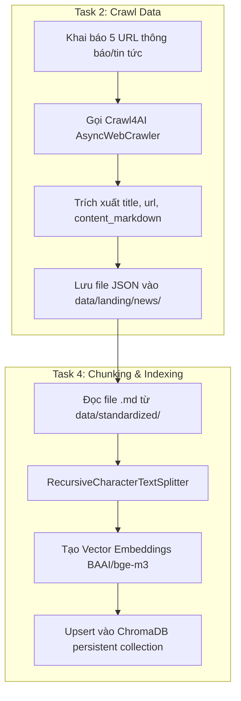

# 📋 Kế Hoạch Triển Khai Chi Tiết: Phần Việc 2 & 4 (Lab 08 - RAG Pipeline v2)

> **Phần việc phụ trách:**
> 1. **Theo Task:** **Task 2** (Crawl bài viết/thông báo tin tức) & **Task 4** (Chunking & Indexing vào ChromaDB).
> 2. **Theo Role (Sơ đồ nhóm 4 người):** **Role 2** (Data & Retrieval Specialist) & **Role 4** (Evaluation & QA Engineer).

---

## 🎯 1. Mục Tiêu Chi Tiết

- **Task 2**: Triển khai script crawl tự động $\ge 5$ bài viết/thông báo từ trang web đại học, trích xuất metadata và lưu dưới dạng JSON trong `data/landing/news/`.
- **Task 4**: Đọc các văn bản Markdown từ `data/standardized/`, áp dụng chiến lược chunking phù hợp (`CHUNK_SIZE=800`, `CHUNK_OVERLAP=100`), tạo embeddings với mô hình `BAAI/bge-m3` và index toàn bộ vào cơ sở dữ liệu vector **ChromaDB** (`chroma_db/`).
- **Nghiệm thu**: Chạy bộ kiểm thử tự động `pytest tests/test_individual.py` vượt qua tất cả các test case của Task 2 và Task 4.

---

## ⚠️ User Review Required

> [!IMPORTANT]
> **Lưu ý về môi trường & Dữ liệu:**
> 1. **Crawl4AI & Playwright:** Để chạy Task 2, cần đảm bảo đã cài đặt trình duyệt Chromium bằng lệnh `playwright install chromium`. Nếu các trang web nguồn bị chặn (lỗi HTTP 403/Anti-bot), có thể sử dụng giải pháp fallback ghi file JSON mẫu theo đúng schema yêu cầu.
> 2. **Cấu hình Chunking & Embedding (Task 4):**
>    - `CHUNK_SIZE`: 800 ký tự (đảm bảo chứa đủ 1-2 ý hoàn chỉnh mà không vượt ngữ cảnh).
>    - `CHUNK_OVERLAP`: 100 ký tự (chống mất ngữ cảnh ở ranh giới vết cắt).
>    - `EMBEDDING_MODEL`: `BAAI/bge-m3` (đa ngôn ngữ, hỗ trợ cực tốt tiếng Việt và tiếng Anh).

---

## 🛠️ 2. Các Bước Triển Khai Từng Bước (Step-by-Step)



---

### 🔹 Bước 1: Hoàn Thành Task 2 (`src/task2_crawl_news.py`)

1. **Chuẩn bị danh sách URL:**
   Khởi tạo `ARTICLE_URLS` với 5 link thông báo/tin tức tuyển sinh hoặc dịch vụ sinh viên.

2. **Triển khai hàm `crawl_article(url: str)`:**
   - Sử dụng `crawl4ai.AsyncWebCrawler` để tải nội dung trang web.
   - Trả về dictionary có cấu trúc:
     ```python
     {
         "url": url,
         "title": result.metadata.get("title", "Unknown"),
         "date_crawled": datetime.now().isoformat(),
         "content_markdown": result.markdown
     }
     ```
   - Xử lý ngoại lệ nếu trang bị chặn hoặc lỗi mạng.

3. **Triển khai hàm `crawl_all()`:**
   - Tạo thư mục `data/landing/news/` nếu chưa có.
   - Duyệt qua từng URL và ghi kết quả ra file `data/landing/news/article_01.json` ... `article_05.json`.

---

### 🔹 Bước 2: Hoàn Thành Task 4 (`src/task4_chunking_indexing.py`)

1. **Cấu hình tham số:**
   - `CHUNK_SIZE = 800`
   - `CHUNK_OVERLAP = 100`
   - `CHUNKING_METHOD = "recursive"`
   - `EMBEDDING_MODEL = "BAAI/bge-m3"`
   - `COLLECTION_NAME = "university_services_docs"`

2. **Triển khai `load_documents()`:**
   - Duyệt tất cả các file `.md` trong `data/standardized/legal/` và `data/standardized/news/`.
   - Trả về danh sách dict: `{"content": content, "metadata": {"source": filename, "type": doc_type}}`.

3. **Triển khai `chunk_documents(documents)`:**
   - Khởi tạo `RecursiveCharacterTextSplitter(chunk_size=800, chunk_overlap=100, separators=["\n\n", "\n", ". ", " ", ""])`.
   - Phân đoạn từng document và lưu `chunk_index` vào metadata.

4. **Triển khai `embed_chunks(chunks)`:**
   - Sử dụng `SentenceTransformer("BAAI/bge-m3")` để tính embedding cho danh sách các đoạn text.
   - Gán danh sách vector kết quả vào key `embedding` của mỗi chunk.

5. **Triển khai `index_to_vectorstore(chunks)`:**
   - Kết nối ChromaDB: `chromadb.PersistentClient(path="chroma_db")`.
   - Tạo/Lấy collection `university_services_docs` với metadata `{"hnsw:space": "cosine"}`.
   - Upsert dữ liệu (ids, documents, embeddings, metadatas) vào ChromaDB.

---

### 🔹 Bước 3 (Nếu mở rộng sang Role 4): BM25 Search & RAGAS QA

1. **Task 6 (`src/task6_lexical_search.py`)**:
   - Sử dụng `rank_bm25.BM25Okapi` xây dựng bộ tìm kiếm từ khóa chính xác trên tập chunks.
2. **Đánh giá RAGAS (`group_project/evaluation/`)**:
   - Xây dựng 15 bộ câu hỏi-đáp mẫu trong `golden_dataset.json`.
   - Chạy `eval_pipeline.py` để tính 4 chỉ số (Faithfulness, Relevancy, Recall, Precision).

---

## 🧪 3. Kế Hoạch Kiểm Thử (Verification Plan)

### 🤖 Kiểm Thử Tự Động (Automated Tests)
Chạy các lệnh pytest sau trong terminal:

```bash
# 1. Kiểm tra Task 2 (Crawl news)
python -m pytest tests/test_individual.py -k "TestTask2" -v

# 2. Kiểm tra Task 4 (Chunking & Indexing)
python -m pytest tests/test_individual.py -k "TestTask4" -v

# 3. Kiểm tra kết hợp Task 2 và Task 4
python -m pytest tests/test_individual.py -k "TestTask2 or TestTask4" -v
```

### 🔍 Kiểm Thử Thủ Công (Manual Verification)
1. **Kiểm tra file JSON đầu ra của Task 2:**
   - Mở thư mục `data/landing/news/` xem có tối thiểu 5 file `.json` dung lượng $>500$ bytes.
   - Đảm bảo mỗi file JSON chứa đầy đủ các trường `url`, `title`, `date_crawled`, `content_markdown`.
2. **Kiểm tra cơ sở dữ liệu Vector ChromaDB của Task 4:**
   - Mở thư mục root xem có xuất hiện folder `chroma_db/`.
   - Chạy script kiểm tra số lượng chunk đã index thành công.
